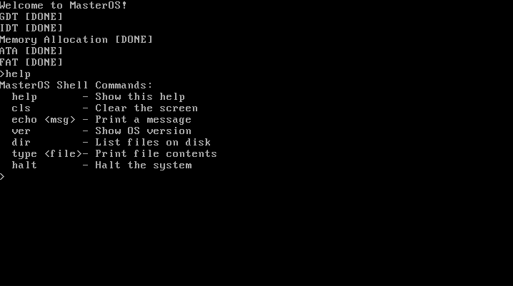
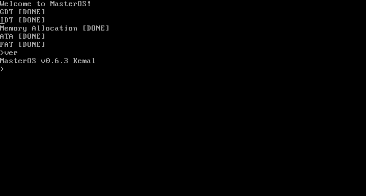
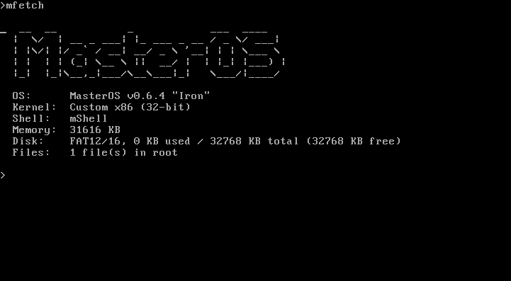

# MasterOS
Think of an operating system that is lightweight, TUI-based, and open source!
Well you just met MasterOS.

# Origin
MasterOS started as an script series made with batch. 
then we built it with C# using the C.O.S.M.O.S toolkit to try creating an Operating System.
And finally we are using C and Rust on 2 different OS projects (The rust one is just for experience)

## Dev team
- gtaha23
- e0tra

## System Requirements
- 32 MB Hard Disk
- 16 MB RAM
- Any 1 Core or more x86 / amd64 CPU
- GPU optional
- Note: !! This statistics are tested !!

# Updates / Logs
- v0.6.4 Iron version
- renaming files added
- creation/deletion of files added
- filesystem commands added

# Spoilers
- More commands going to be added

# Want to help us?
You can reach us from our e-mails to join our project and contribute to the mOS projects!

# ScreenShots
- The help command working  

- The version being checked  

- The famous oldfetch command renamed to mfetch  
