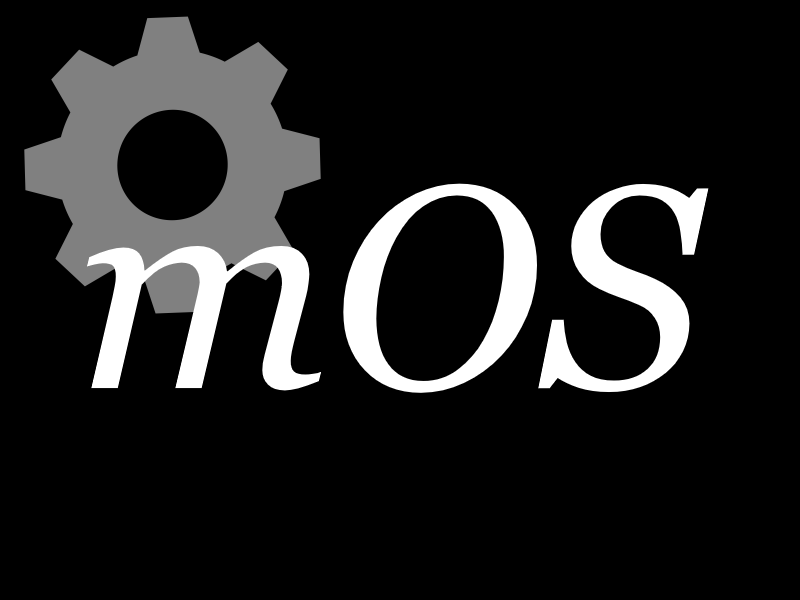
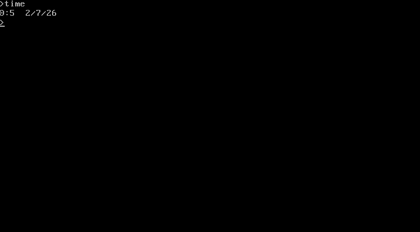
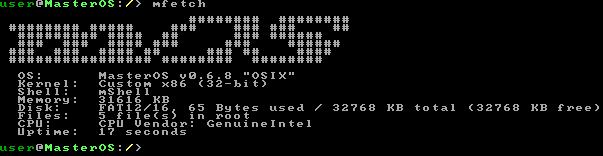

<div align="center">



# MasterOS

### Lightweight • Open Source • x86 Operating System

*A hobby operating system written in C, focused on learning kernel development and low-level systems programming.*

[](#)
[](#)
[](#)

</div>

---

# About

**MasterOS** is a lightweight, open-source operating system written primarily in **C**, with an experimental **Rust** branch for exploring modern systems programming.

Rather than targeting everyday desktop use, MasterOS is a learning-oriented operating system designed to explore:

- Kernel development
- Memory management
- Interrupt handling
- Device drivers
- VGA graphics
- Filesystems
- Command-line interfaces
- Low-level x86 programming

MasterOS currently provides a lightweight **terminal user interface (TUI)** while a graphical interface is planned for future releases.

---

# History

The project has evolved through multiple generations.

### Generation 1

A simple operating-system simulation written entirely in **Batch**.

### Generation 2

Rewritten in **C#** using the **COSMOS Toolkit** to create a bootable operating system.

### Generation 3 (Current)

A complete rewrite in **C**, featuring its own kernel, drivers, memory management, interrupt handling, and command interpreter.

### Generation 4 (Experimental)

A parallel implementation in **Rust**, created for learning modern systems programming concepts.

---

# Features

- Lightweight kernel
- Interactive shell
- Command interpreter
- VGA text mode support
- Keyboard input
- Interrupt Descriptor Table (IDT)
- Memory management
- Executable loader
- Dynamic version system
- Modular architecture
- Open source

---

# Screenshots

## Help Command


---

## Version Command


---

## mfetch


---

## Time Command



---

## New VGA Driver



---

# System Requirements

| Component | Minimum |
|------------|---------|
| CPU | x86 |
| RAM | 16 MB |
| Storage | 32 MB |
| GPU | Optional |

> These requirements were measured during testing.

---

# Building

## Required Packages (Ubuntu / Debian)

```bash
sudo apt install \
build-essential \
gcc \
g++ \
make \
cmake \
nasm \
xorriso \
grub-pc-bin \
grub-common \
mtools \
qemu-system-x86 \
gdb \
git \
wget \
curl \
python3 \
python3-pip \
bison \
flex \
libgmp3-dev \
libmpc-dev \
libmpfr-dev \
texinfo \
libisl-dev
```

---

## Clone

```bash
git clone https://github.com/gtaha23/MasterOS.git
cd MasterOS
```

---

## Build

```bash
make
```

---

## Run

```bash
make run
```

or

```bash
qemu-system-i386 -cdrom kernel.iso \
	    -drive file=disk.img,format=raw,index=1,media=disk,if=ide \
	    -boot d -m 32 \
	    -display gtk \
	    -audiodev alsa,id=speaker \
	    -machine pcspk-audiodev=speaker
```

---

# Roadmap

## Current

- Interrupt handling
- Memory management
- Shell
- VGA driver
- Executable loading

## Planned

- GUI
- Virtual file system
- FAT support
- Better scheduler
- Networking
- User mode
- Multitasking
- ELF loader
- USB support
- Audio

---

# Latest Update

## v0.6.9 (OSIX)

### Improvements

- Improved interrupt debugging
- Dynamic version constant
- Fixed execution crashes
- Memory subsystem improvements
- IDT fixes
- Executable loader patches

---

# Development Team

| Name | Role |
|------|------|
| gtaha23 | Founder & Lead Developer |
| e0tra | Developer |

---

# Why MasterOS?

MasterOS is built to learn how modern operating systems work from the ground up.

Instead of relying on existing kernels, nearly every subsystem is developed manually, making the project an excellent playground for systems programming.

Whether you're interested in kernels, bootloaders, drivers, or low-level architecture, contributions and discussions are always welcome.

---

# Contributing

Contributions are welcome!

Feel free to:

- Report bugs
- Suggest features
- Improve documentation
- Submit pull requests

If you'd like to become part of the development team, don't hesitate to get in touch.

---

# License

This project is licensed under the GPL License.

---

<div align="center">

**Built with ❤️ in C (and a little Rust).**

⭐ Star the repository if you enjoy operating system development.

</div>
